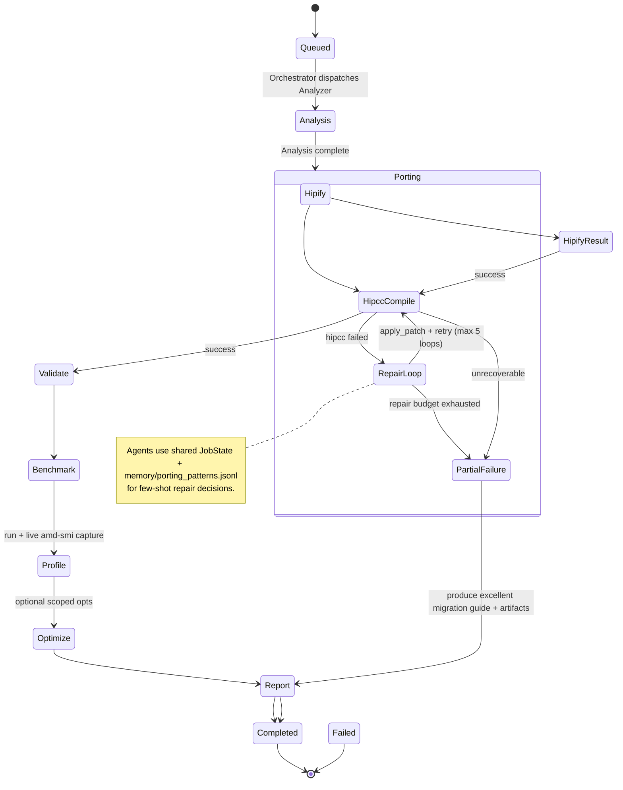

# ROCmForge Phase 2 — Agent State Machine (Light Preparation)

**Status**: Preparation artifact only. Not implemented yet. Created during Phase 1 polish while waiting for real MI300X hardware.

## High-Level State Machine (Mermaid)

## Key Transitions & Agent Responsibilities

- **Queued → Analysis**: Orchestrator + Analyzer
- **Porting (core repair loop)**: HIP Porting Specialist (star agent)
  - Calls `run_hipify`, `run_hipcc`
  - On failure: reads logs + source, decides patch (search/replace or diff), calls tool to apply, re-runs.
  - Memory injection: prepend relevant patterns from `memory/porting_patterns.jsonl`
- **Validate**: Validator agent (CPU ref compare for seeds)
- **Benchmark + Profile**: Benchmark & Profiler (live amd-smi timeseries)
- **Optimize** (Day 3): Optimizer (safe compile flags, block size hints, etc.)
- **Partial Failure path**: Always produce report + tar. Agents decide "cap repair loops → excellent guide"
- **Completed**: Reporter finalizes + learning step (append successful patterns to memory)

## Tools Surface (for agents)

- `run_hipify(source_dir, out_dir)`
- `run_hipcc(sources, out_binary, arch="gfx942")`
- `read_file`, `write_patch` (or apply_unified_diff)
- `capture_amd_smi_snapshot` + background sampler
- `run_binary` + parse output
- `read_job_state` / `update_job_state` (blackboard)
- `search_memory(pattern_type)` → returns top-k from porting_patterns.jsonl

## Memory Pattern Format (see memory/porting_patterns.jsonl)

Each line is a JSON object with:
- `pattern_id`
- `cuda` / `hip` mapping
- `notes` (why it works, MI300X gotchas)
- `confidence`
- `source` (which seed or research)

Future agents will retrieve relevant patterns and inject into system prompt for the current kernel.

## Next Implementation Steps (when hardware is solid)

1. Choose framework: LangGraph (recommended for stateful + conditional edges) or lightweight custom ReAct loop.
2. Implement thin tool wrappers (already mostly exist in `src/tools/rocm.py` + workspace).
3. Wire Orchestrator as graph entrypoint.
4. Add `memory/` loader + prompt injection.
5. Stream agent thoughts to existing SSE feed (reuse `AgentMessage` model).
6. Add repair loop cap + partial success reporter.

**This document + the jsonl file + the existing baseline pipeline give us a very strong head start for Phase 2 once Day 0 real numbers are captured.**

See also: `spec/AGENT_ROLES_AND_PROMPTS.md`, `plan/5DAY_BLUEPRINT_AND_PHASES.md`, `track/SUBMISSION_CHECKLIST.md`.
